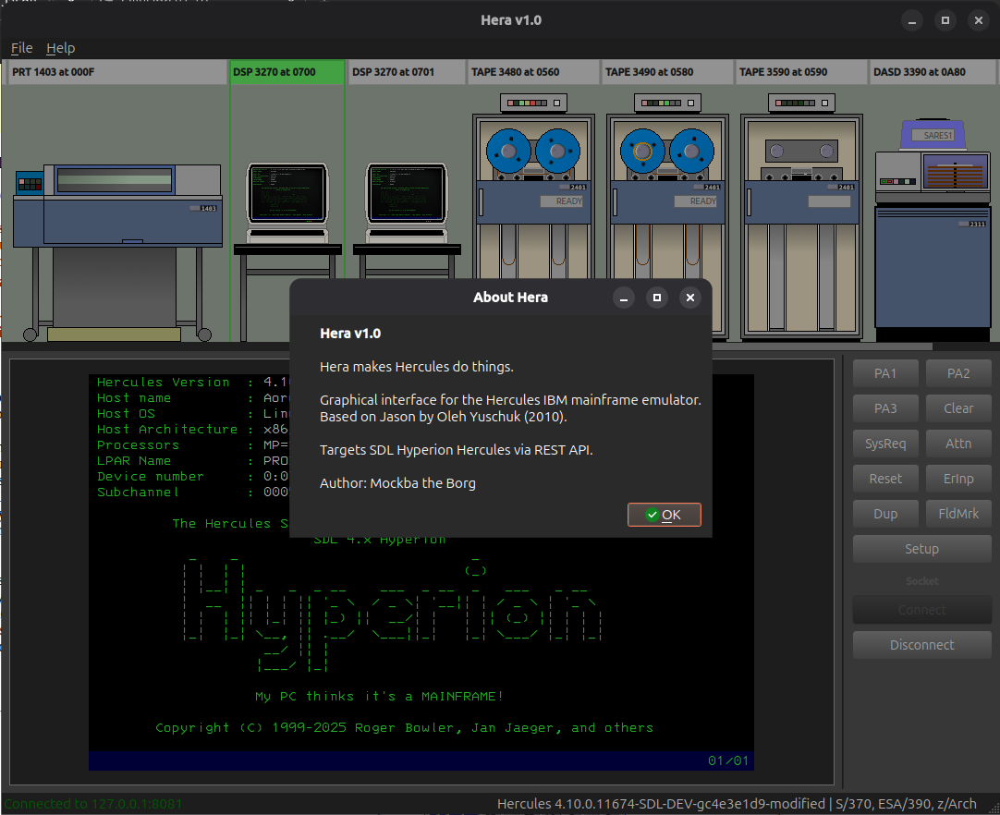

# Hera — Hercules Hyperion GUI

Hera is a graphical front-end for the [SDL Hercules](https://github.com/SDL-Hercules-390/hyperion) IBM mainframe emulator.  
It is based on Jason (by Oleh Yuschuk) and builds on it to provide a modern PySide6 interface, offering a visual workspace for managing CPUs, DASD, tapes, card readers/punches, printers, 3270 terminals, and the operator console — all from a single window.

> **Platform note:** Hera is developed and tested on Linux. It contains no OS-specific code and may work on macOS or Windows, but those platforms have not been tested.
 


---

## Requirements

- Python 3.11 or newer
- A running SDL Hyperion Hercules instance with its REST API enabled (port 8081 by default)

---

## Installation

```bash
# 1. Clone the repository
git clone https://github.com/MockbaTheBorg/Hera
cd Hera

# 2. Create and activate a virtual environment
python3 -m venv venv
source venv/bin/activate

# 3. Install dependencies
pip install -r requirements.txt
```

---

## Running Hera

```bash
# Connect to the local Hercules instance (default: 127.0.0.1:8081)
python hera.py

# Connect to a remote host or non-default port
python hera.py --host 192.168.1.10 --port 8081
```

| Option | Default | Description |
|--------|---------|-------------|
| `--host` | `127.0.0.1` | Hostname or IP of the Hercules REST API |
| `--port` | `8081` | Port of the Hercules REST API |

---

## Notes

- Hera saves its settings to `~/.config/hera/hera.conf`.
- Command-line options override values stored in the config file.
- The Hercules REST API must be reachable before starting Hera; otherwise the device panels will show as disconnected.

---

## Credits

- **Jason** (original inspiration) — by Oleh Yuschuk
- **SDL Hercules** — by Roger Bowler, Jay Maynard, Jan Jaeger, and the [SDL Hercules community](https://github.com/SDL-Hercules-390/hyperion)